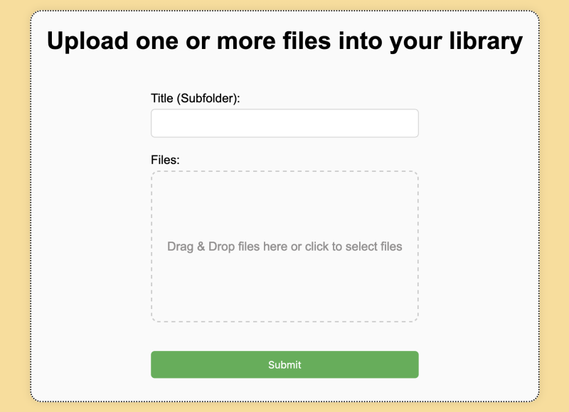

# library-upload

## Features
Library-upload offers a simple web frontend to upload files into a given server directory (e.g. for ebook libraries).



### Currently implemented:
* Selection of one or more files via drag and drop or file dialog
* Upload into same directory, or (nested) subdirectories
* Basic path validation against path traversal
* Easy and fast deployment as docker container

### Potential further development
* More thourough path validation
* Password protection
* Autocomplete suggestion for folder names based on existing directories
* Automatic build pipeline
* Not trusting all proxies in Gin

### Usage
* When running the program point it to the path of your library. The default access is via port 8080 in your browser.
* Enter the relative target path for your upload in the "Title (Subfolder)" field. Keeping it empty will put the file in the library root directory. You can enter a folder name (e.g. Jon Doe) or a subfolder (e.g. Newspaper/2024).
* You can select one or more files. When you press "Submit" they will be uploaded to your server's library directory and a confirmation message will appear below the "Submit" button. Directories will be created if they dont exist yet.  
* As of now this is for network-internal use only. Do not run this on an unprotected, publicly exposed server as this invites abuse.

## Architecture and development
The backend is written in [Go](https://go.dev/) and uses [Gin](https://github.com/gin-gonic/gin) as web framework. A simple router provides the /upload route.
The frontend is a static HTML page using JQuery and providing a form that triggers a POST request to the backend for upload. The frontend is also served by Gin.

For running the application on your machine [setup Go](https://go.dev/doc/install), clone the repository and then run the following commands:
```shell
# switch into source directory
cd src

# download dependencies
go mod download

# run the application
go run main.go
```

The application is also dockerized, so you can build the container as needed. For running the container see the provided docker_compose.yml.
```shell
docker build --tag library-upload .
```
